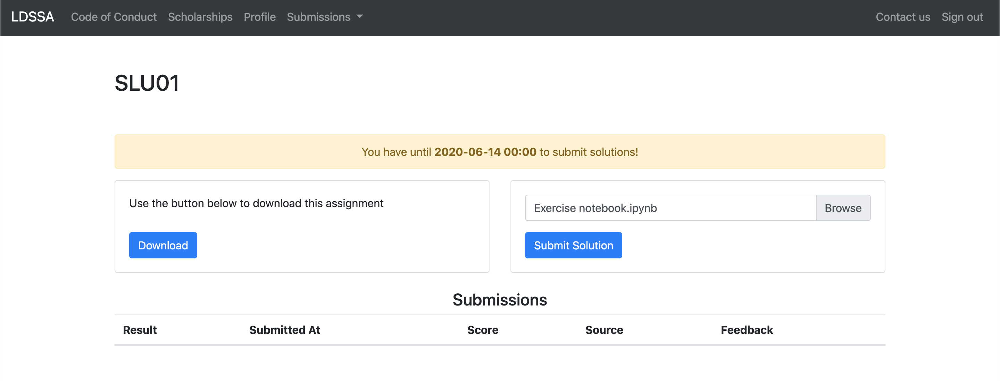

# Small Learning Unit 1 - Pandas 101

Welcome to the first SLU.

The first thing you need to do is to setup your local environment, so that you can run the all the notebooks in the SLU.

With your setup in place, you should go through the notebooks in this order:
* `Learning Notebook`: here we'll teach you all the basics of [Pandas](https://pandas.pydata.org/docs/).
* `Examples Notebook`: here you'll find a summary of the methods that you've learned in the `Learning Notebook`.
* `Exercise Notebook`: here you'll find the exercises that you should complete and submit.

Once you're done with the three notebooks, you should submit your `Exercise Notebook` for grading, in the portal.

Keep reading to learn how to setup your local environment and how to submit your assignment.

### Setup your local environment

In order for you to go through the notebooks, you need to:
* Have Python 3.7 installed in your machine.
* Create a python virtual environment.
* Install the requirements listed in the `requirements.txt`, in your virtual env (note: it is paramount that the packages that you install have the exact same version as in the `requirements.txt` file, because those are the versions that we're using to grade your notebooks).
* Be able to open a Jupyter Notebook and run code there.

If you know what you're doing, the above instructions should be enough :p

Otherwise, we have a guide that explains how to set up a Python environment and install requirements [here](https://github.com/LDSSA/ds-prep-course-2021#1-initial-setup). The parts that are sufficient and necessary for you to setup your local environment are:
* Setup
    * [Windows 10 Setup](https://github.com/LDSSA/ds-prep-course-2021#11a-windows-10-setup)
    * [Ubuntu Setup](https://github.com/LDSSA/ds-prep-course-2021#11b-ubuntu-setup)
    * [MacOS Setup](https://github.com/LDSSA/ds-prep-course-2021#11c-macos-setup)
    * [MacOS M1 Setup](https://github.com/LDSSA/ds-prep-course-2021#11d-macos-m1-setup)
* [Creating Python Virtual Environment](https://github.com/LDSSA/ds-prep-course-2021#15-creating-a-virtual-environment)
* [Learning Unit Workflow](https://github.com/LDSSA/ds-prep-course-2021#2-learning-unit-workflow) - this part is about installing requirements and launching a Jupyter Notebook

Alternatively, you can achieve the same by using Anaconda:
* [installing Anaconda](https://docs.anaconda.com/anaconda/install/)
* [launching a Jupyter Notebook](https://docs.anaconda.com/anaconda/user-guide/getting-started/#run-python-in-a-jupyter-notebook)
* [installing a Python package on Anaconda](https://docs.anaconda.com/anaconda/user-guide/tasks/install-packages/)

### Submitting your work for grading

You've downloaded a zip file with this SLU from the portal [here](https://portal.lisbondatascience.org/admissions/candidate/slu/slu01).

In order to pass this SLU, you have to solve the exercises from the `Exercise Notebook`, submit them for grading and get a score of at least 16 (out of 20).

> In the submissions file uploader, you should upload **only the `Exercise Notebook` with your solutions**, you don't need to create a zip file or anything else!

Example:

After you submit, you'll see the grade of your submission, and whether you passed or not.
You can click in "Open" in the feedback column to see how much did you score in each question.

For SLUs, you can make as many submissions as you like until the due date. So take your time to work on this assignment :)

---

### New concepts in this unit

- Importing Pandas
- Pandas Series
- Pandas DataFrame
- Previewing a DataFrame
- Retrieving Dataframe Information
- Reading/Writing data 

### New tools in this unit

- [`pandas.Series`](https://pandas.pydata.org/pandas-docs/stable/generated/pandas.Series.html)
- [`pandas.DataFrame`](https://pandas.pydata.org/pandas-docs/stable/generated/pandas.DataFrame.html)
- [`pandas.Series.dtype`](https://pandas.pydata.org/pandas-docs/stable/generated/pandas.Series.dtype.html)
- [`pandas.Series.array()`](https://pandas.pydata.org/pandas-docs/stable/generated/pandas.Series.array.html)
- [`pandas.Series.to_numpy()`](https://pandas.pydata.org/pandas-docs/stable/generated/pandas.Series.to_numpy.html)
- [`pandas.DataFrame.index`](https://pandas.pydata.org/pandas-docs/stable/generated/pandas.DataFrame.index.html)
- [`pandas.DataFrame.columns`](https://pandas.pydata.org/pandas-docs/stable/generated/pandas.DataFrame.columns.html)
- [`pandas.DataFrame.dtypes`](https://pandas.pydata.org/pandas-docs/stable/generated/pandas.DataFrame.dtypes.html)
- [`pandas.DataFrame.head()`](https://pandas.pydata.org/pandas-docs/stable/generated/pandas.DataFrame.head.html)
- [`pandas.DataFrame.tail()`](https://pandas.pydata.org/pandas-docs/stable/generated/pandas.DataFrame.tail.html)
- [`pandas.DataFrame.shape`](https://pandas.pydata.org/pandas-docs/stable/generated/pandas.DataFrame.shape.html)
- [`.info()`](https://pandas.pydata.org/pandas-docs/stable/generated/pandas.DataFrame.info.html)
- [`.describe()`](https://pandas.pydata.org/pandas-docs/stable/generated/pandas.DataFrame.describe.html)
- [`pandas.read_csv()`](https://pandas.pydata.org/pandas-docs/stable/generated/pandas.read_csv.html)
- [`pandas.to_csv()`](https://pandas.pydata.org/pandas-docs/stable/generated/pandas.read_csv.html)
